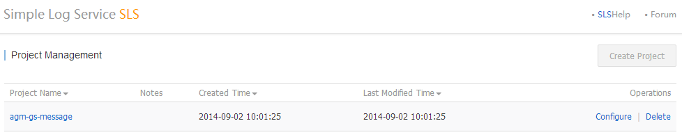

SLS Operation Guide
===================

_Notice that this is not an official translation of [Chinese version](http://imgs-storage.cdn.aliyuncs.com/help/sls/%E7%AE%80%E5%8D%95%E6%97%A5%E5%BF%97%E6%9C%8D%E5%8A%A1%E6%8E%A7%E5%88%B6%E5%8F%B0%E6%93%8D%E4%BD%9C%E6%8C%87%E5%8D%97version0.2.1.pdf), please also check the [official online help](http://help.aliyun.com/all/11113802.html)._

Overview
-------------------

Typically, "server - log collection - log storage - browse and/or analysis" makes a complete log pipeline. With *ELK stack* from the open source world, *LogStash* collects logs, *ElasticSearch* is the log store, *Kibaba* aids browsing and searching.

[Simple Log Service (SLS)](http://www.aliyun.com/product/sls/) is an Aliyun service for tenant users to build their own logging infrastructure; it is roughly a replacement of *ELK stack*, eliminating significant maintenance efforts as typical cloud products, however, certain flexibility such as integration of many tools are traded. This operation guide helps to plug into the logging infrastructure.

Operations such as project space management and log parsing configuration are done in the [SLS Admin Console](http://sls.console.aliyun.com/). Both Project and Category are important concepts.

> Side note: SLS is currently available in the same region (Hangzhou) by application, and the official log collection tool, ilogtail, supports only 64-bit Linux.

Sign in with Aliyun Account
-------------------

You operate SLS projects in the [SLS Admin Console](http://sls.console.aliyun.com/) with Aliyun account. If you do not have an Aliyun account yet, please [obtain one](http://www.aliyun.com/).

* Cannot sign in SLS Portal

  If you already have a Aliyun account, make sure at least one AccessKey is defined in your account. Otherwise, you cannot sign in SLS Portal.

* How to create an AccessKey

  Sign in Aliyun Portal, open the Admin Console, click the AccessKeys button in the top navigation bar, and add one.

SLS Project
-------------------

Having signed in the SLS Portal, the Project List page is displayed. 

Figure 1. Project List

Currently only one SLS project can be created per account. However, more can be requested through the Aliyun ticket system, just hover the pointer over the Create Project button to get the entrance link.

SLS project is the base unit to enforce bandwidth limit of the logging traffic.

Category
-------------------

An SLS project may contain many categories, each defining its own log collection and log consumption. Clicking a project in the Project List page switches to Category List page of the chosen project. 

Figure 2. Category List

Then a new category can be created. When a new category is created, you define log consumption, then configure logtail, the log collection tool.

Figure 3. Create a Category

Log Collection determines location of log files, how to parse log entries, and which server groups to install ilogtail. Comparatively, [LogStash](http://logstash.net/) is an open source conterpart of ilogtail. However, SLS also accepts log pushed through SLS API, which is not covered in this guide, and ilogtail is automatically installed with configuration fetched from SLS.

Log Consumption determines the storage of log entries. Two strategies are available: saved for a week to serve real-time searching, archived to ODPS project for offline analysis. Either one or both should be chosen.

Configure Logtail
-------------------

There are three steps to configure logtail:

1. Specify log files to track
2. Specify parsing rules of log entries
3. Determine which server groups to install ilogtail and apply the configuration assembled by step 1 and 2.

Since ilogtail use regular expressions to determine boundaries of multiline logs and to capture fields, however, regular expressions are rather weird to many people, SLS povides several online tools to assist the deducing of regular expressions in step 1 and 2. Hand craft ones can be used when auto-gneration is imperfect.

Figure 4. Configure Logtail, step 1

Figure 5. Configure Logtail, step 2, with auto-generation tool

Figure 6. Configure Logtail, step 2, with hand-craft regular expression

A running ilogtail instance consists of two processes, one of which supervises the other.

    $ ps aux|grep logtail
    admin    10495  0.0  0.0  61164   760 pts/1    S+   18:44   0:00 grep logtail
    root     15304  0.0  0.0  46868  2180 ?        Ss   Aug05   0:00 /usr/local/ilogtail/ilogtail
    root     15305  0.0  0.0 123768  8964 ?        Sl   Aug05   3:21 /usr/local/ilogtail/ilogtail

Notice that ilogtail supports strftime(3) specification for the required _time_ field. Date format of traditional syslog is not recognized because of year is missing, and rsyslog date-rfc3339 timestamp should be truncated because of milliseconds are not recognized, either. Find below changes to the default rsyslog configuration:

    $template TraditionalFileFormat,"%TIMESTAMP:1:19:date-rfc3339% %HOSTNAME% %syslogtag%%msg:::sp-if-no-1st-sp%%msg:::drop-last-lf%\n"
    $ActionFileDefaultTemplate TraditionalFileFormat

ilogtail is installed by the Aliyun CloudShield service, so each server in the defined sever group should have Aliyun CloudShield client installed, which is installed by default and can be checked with:

    # ps aux |grep aeg
    root      7943  0.0  0.0 474532  4136 ?        Ssl  Sep01   0:19 /usr/local/aegis/aegis_update/aegis_update -f agx_update.cfg
    root      8001  0.0  0.0 779500  5820 ?        Ssl  Sep01   1:06 /usr/local/aegis/aegis_client/aegis_00_33/aegis_cli -f conf/aegiscli.cfg
    root     18266  0.0  0.0 103248   816 pts/0    R+   19:09   0:00 grep aeg

The final caveat is ilogtail supports only 64-bit Linux, otherwise, error will be reported when creating server group to ilogtail installation.

When a server group is selected and applied ilogtail configuration, the Category Detail page is displayed for real-time searching. Notice that the ilogtail installation takes 1~2 minutes to complete, so be a little patient for the first lines of logs.

Figure 7. Real-time Searching

Server Group
-------------------

A server group consists of a list of internal IP addresses of ECS instances. The heartbeat status of the server group can be verified in the ServerGroup List.

