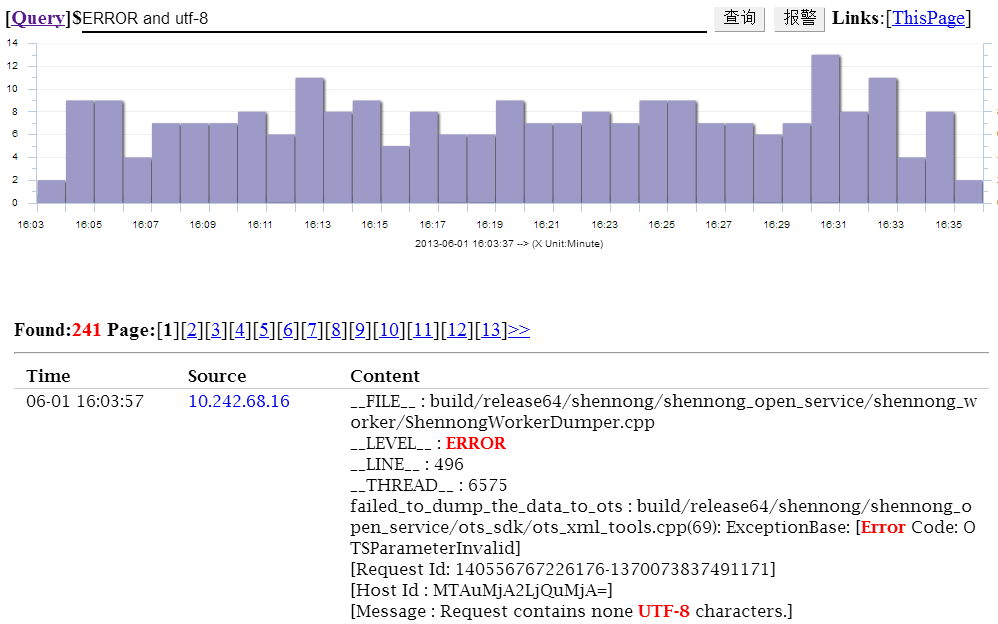
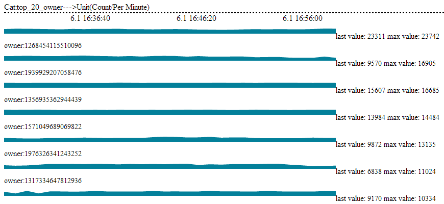
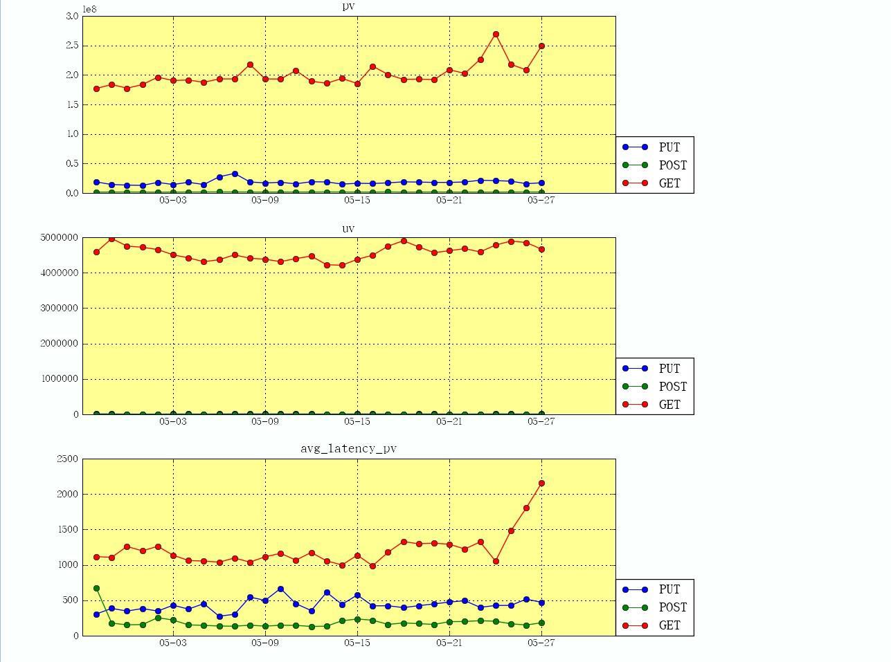
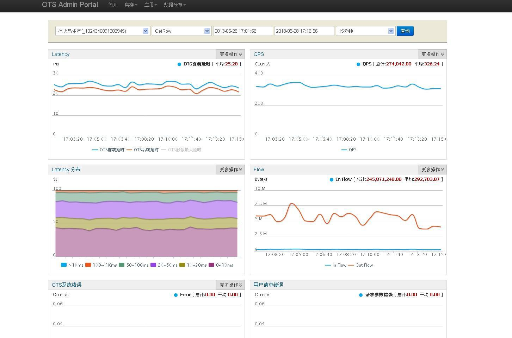

Aliyun Simple Log Service (SLS) Tutorial
===================

_Notice that this is not an official translation of the [Chinese version](http://slsweb.aliyun-inc.com/first.pdf)._

Typical Use Case
-------------------

I am a web master, I have Apache instances and home-built applications on multiple servers.

Recently, I got much trouble. The applications crashed now and then. To do troubleshooting, I had to log in to different servers to check error logs. It is really a miserable life!

### Log Collection

Q1. Is there any easy way to collect application logs?

A1. Yes, SLS provides a tool called *[ilogtail](http://slsweb.aliyun-inc.com/input.html#logtail)* to collect logs in near real time and feed into SLS service. ilogtail monitors specified log files and extracts with regular expressions against each line.

### Searching

Q2. How to browse and search the collected logs?

A2. You can search by keywords with `AND`, `OR` and `NOT` groups. Say some guy complained about data corruption, a search with "ERROR" shows certain requests contain non-UTF-8 characters, which suggests a bug because the application is UTF-8 only. A further search with "ERROR and UTF-8" gets 241 matches. Now it is time to push a patch.

Please refer to [Query Grammer](http://wiki.aliyun-inc.com/projects/apsara/wiki/ShennongOpenService/IndexServer/QueryGrammer) for help about complex queries.

### Real-time Analysis

Q3. Would you please find the top 20 visitors to my website? I wish to check the top20 list at any time.

A3. Sure. Real-time aggregations such as `count`, `sum`, `avg`, `max`, `topk`, `groupby` and `filter` are supported. Please refer to [Aggregation Functions](http://slsweb.aliyun-inc.com/config.html#function_agg) for more aggregation functions.

Here is a snapshot of the requested real-time top20 list:

### Monitoring and Alerting

Q4. So far, so good. I want to be aware of critical errors when the server generates 500 responses. Can you remind me?

A4. SLS has an alerting plugin to turn real-time reports into alerts, which may also trigger execution of specified scripts. Please find below a snapshot, and refer to [Alarm Usage](http://slsweb.aliyun-inc.com/alarm_usage.pdf) for configuration instructions.

### Offline Analysis and Reports

Q5. So we have real-time aggregation and alerting. I appreciate complex analysis to see how the visitors use my website, to get the daily page view, to figure out which pages are the most popular ones, and to figure out which provinces do the visitors come from. Can you make it?

A5. Sure. Logs collected by SLS can be fed into Open Data Processing Service (ODPS), which is a powerful service provided by Aliyun for you to do any complex analysis. All you need is to obtain an ODPS account, create tables to hold the logs, and grant permission to SLS. Please refer to [ODPS Archive](http://slsweb.aliyun-inc.com/config.html#function_odps) for detailed instructions.

Here are a few snapshots.

Interested? Please visit the [official website](http://slsweb.aliyun-inc.com).
